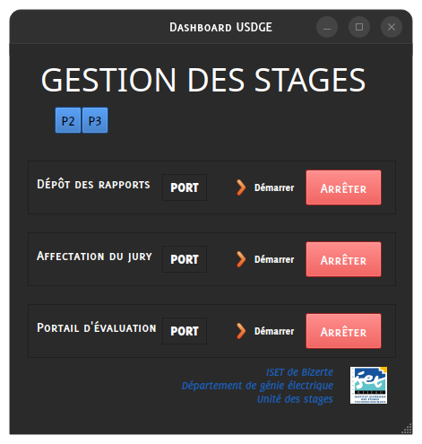
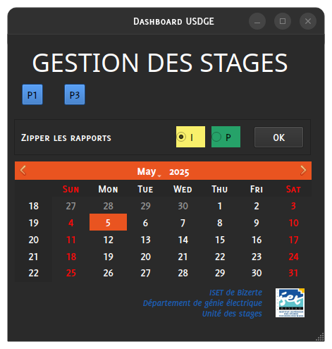
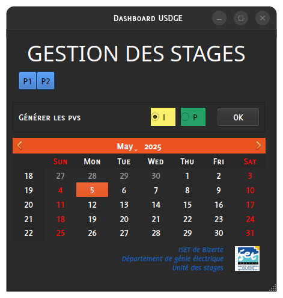

# Tableau de bord de pilotage des stages - Département Génie Électrique #

**Lancer les serveurs** *(dépôt, affectation jury, et soutenance)*

**Zipper les fichiers par jury**

**Générer les PVs**

Cette application est fourni sous licence **MIT** - Voir le fichier  pour plus de détails. 
